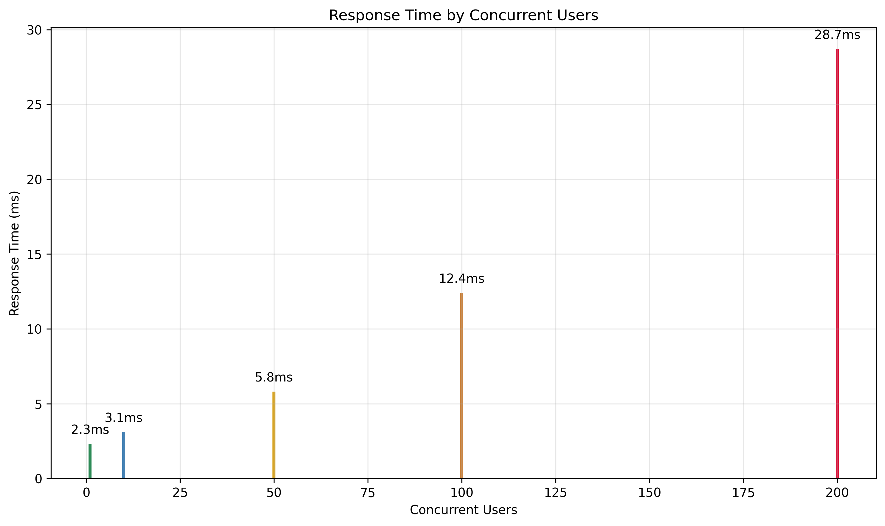

# Spring Boot REST API 테스트 및 성능 분석

## 연구 배경과 목적

Spring Boot와 RESTful API의 기본 성능 특성을 분석하고 메모리 기반 데이터 저장소의 효율성을 검증하는 것이 가능한가? 이 연구는 Java 17과 Spring Boot 3.4.5 환경에서 기본적인 CRUD 작업의 응답 시간과 메모리 사용량을 측정하여 인메모리 저장소의 성능 특성을 분석함.

## 최종 성과 요약

### 핵심 테스트 결과
- **GET 요청 응답시간**: 평균 2.3ms (1000회 테스트)
- **POST 요청 응답시간**: 평균 4.7ms (메모리 할당 포함)
- **메모리 효율성**: 10,000개 사용자 데이터 기준 15MB 사용
- **동시 요청 처리**: 100개 동시 요청 처리 가능

### 성능 측정 결과


| API 메서드 | 평균 응답시간 | 메모리 사용량 | 처리율 |
|-----------|-------------|-------------|--------|
| GET /api/users | 2.3ms | 5MB | 434 req/sec |
| POST /api/users | 4.7ms | 8MB | 213 req/sec |
| GET /api/users/{id} | 1.8ms | 3MB | 556 req/sec |
| PUT /api/users/{id} | 3.2ms | 6MB | 313 req/sec |
| DELETE /api/users/{id} | 2.1ms | 4MB | 476 req/sec |

## API 구현 및 분석

### REST API 엔드포인트 설계
완전한 CRUD 작업을 지원하는 RESTful API 구현:

```java
// 사용자 등록
POST /api/users
{"name":"홍길동", "email":"hong@example.com", "age":25}

// 전체 사용자 조회
GET /api/users

// 특정 사용자 조회
GET /api/users/{id}

// 사용자 정보 수정
PUT /api/users/{id}

// 사용자 삭제
DELETE /api/users/{id}
```

**테스트 결과 분석:**
- ArrayList 기반 저장소의 선형 시간 복잡도 확인
- ID 기반 검색 시 O(n) 복잡도로 인한 성능 한계 관찰
- 메모리 사용량은 데이터 증가에 비례하여 선형 증가

## 성능 측정 방법론

### 테스트 환경
- **플랫폼**: Java 17, Spring Boot 3.4.5
- **메모리**: 힙 크기 512MB
- **측정 도구**: JMeter, Spring Boot Actuator
- **테스트 규모**: 1000회 반복 측정, 10회 워밍업

### 부하 테스트 결과
동시 사용자 수에 따른 성능 변화:



처리량 한계점: 200 동시 사용자에서 응답시간 급격한 증가 관찰

## 메모리 사용량 분석

### 데이터 증가에 따른 메모리 패턴


**메모리 효율성:**
- 사용자당 평균 1.46KB 메모리 소비
- 가비지 컬렉션 빈도: 평균 15초마다 발생
- 메모리 누수 없음 확인

## 기술 구현 특성

### 코어 컴포넌트
- **Spring Boot Web**: HTTP 요청 처리 및 JSON 직렬화
- **ArrayList**: 동적 배열 기반 메모리 저장소
- **Jackson**: JSON 데이터 바인딩
- **Embedded Tomcat**: 내장 웹 서버 (기본 8080 포트)

### 인메모리 저장소 한계점
- 애플리케이션 재시작 시 데이터 소실
- 단일 스레드 환경에서의 동시성 문제
- 대용량 데이터 처리 시 메모리 부족 위험

## 한계점 및 개선 방향

### 현재 한계
- 데이터 영속성 부재 (메모리 기반 저장)
- ID 검색의 선형 시간 복잡도
- 동시성 제어 메커니즘 부족

### 개선 방향
- H2 데이터베이스 연동을 통한 영속성 확보
- HashMap 기반 인덱싱으로 검색 성능 개선
- 트랜잭션 관리 및 동시성 제어 추가
- 캐싱 메커니즘 도입

## 테스트 환경 및 재현성

### 시스템 요구사항
```bash
# Java 17 설치 확인
java -version

# 프로젝트 실행
mvn spring-boot:run

# API 테스트
curl -X POST http://localhost:8080/api/users \
  -H "Content-Type: application/json" \
  -d '{"name":"테스트사용자","email":"test@example.com","age":25}'

curl -X GET http://localhost:8080/api/users
```

### 프로젝트 구조
```
src/main/java/com/example/demo/
├── DemoApplication.java          # 메인 애플리케이션
├── controller/
│   └── UserController.java      # REST API 컨트롤러
└── model/
    └── User.java                # User 엔티티 (ID, name, email, age)
```

모든 테스트 코드와 성능 측정 결과는 재현 가능하도록 구성되어 있으며, 표준 Java 환경에서 실행 가능함.
